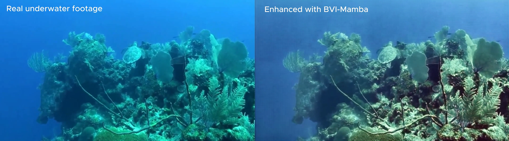
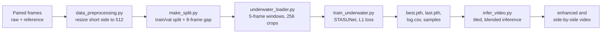

# Underwater Video Enhancement with BVI-Mamba


Retraining **BVI-Mamba**, a low-light video enhancement model, on paired underwater footage, with a complete and reproducible pipeline: preprocessing, training, and tiled video inference.



_Left: original frame. Right: enhanced by the retrained BVI-Mamba. The footage was not part of the training data._

> This is an independent experiment. It is not affiliated with the BVI-Mamba authors, and the weights released here are **not** the weights from the original paper (see [Credits](#credits-citation-and-license)).

## Contents

- [Overview](#overview)
- [Results](#results)
- [Pretrained weights](#pretrained-weights)
- [How it works](#how-it-works)
- [Repository structure](#repository-structure)
- [Data](#data)
- [Model and training configuration](#model-and-training-configuration)
- [Inference](#inference)
- [Environment](#environment)
- [Continue the research on RunPod (step by step)](#continue-the-research-on-runpod-step-by-step)
- [Troubleshooting](#troubleshooting)
- [Ideas for next steps](#ideas-for-next-steps)
- [Known limitations](#known-limitations)
- [Credits, citation, and license](#credits-citation-and-license)
- [Author](#author)

## Overview

[BVI-Mamba](https://github.com/edhuang1/BVI-Mamba) restores dark video using a deformable-convolution alignment stage and a Mamba-based U-Net (`STASUNet`). It was trained on a low-light dataset and no pretrained weights are published.

Underwater footage suffers from a different kind of degradation (strong blue or green color cast, haze, low contrast). This project asks a simple question: **can the same architecture be retrained on paired underwater video and give a visible improvement with a very small compute budget?**

What this repository contains:

- A data pipeline for paired underwater frames (resize, leakage-safe split, 5-frame loader).
- A training script with checkpointing, resume, time budget, and validation samples.
- A tiled inference script for videos of any size, with overlap blending.
- Notes and exact commands to rebuild the environment on a RunPod GPU pod.

Everything was developed on a laptop (Windows, preprocessing only) and a single rented GPU (RTX 4000 Ada, 20 GB).

## Results

The comparison image at the top of this page is a single frame from the demo footage, with the original on the left and the enhanced result on the right.

Training summary:

| Item                 | Value                                                                                                                                                     |
| -------------------- | --------------------------------------------------------------------------------------------------------------------------------------------------------- |
| Model                | `STASUNet` (BVI-Mamba), 10.00 M parameters                                                                                                                |
| Training             | From scratch, L1 loss, Adam                                                                                                                               |
| Hardware             | 1x RTX 4000 Ada (20 GB), about 9.5 GB VRAM used at batch size 4                                                                                           |
| Speed                | about 0.97 s per iteration, about 8.2 min per 2,000-sample epoch                                                                                          |
| Epochs completed     | 26 (epochs 0 to 25). Training was stopped by hand because of the compute budget, far before `maxepoch: 60`, while the training loss was still decreasing. |
| Training volume      | 52,000 samples (13,000 iterations at batch size 4), about 15 times the 3,477 training samples, drawn with replacement and balanced across categories      |
| GPU time             | about 3.6 hours (214 minutes, summed from `log.csv`)                                                                                                      |
| Best validation PSNR | 27.21 dB at epoch 22 (validation loss 0.0742), saved as `best.pth` (see the caveats below)                                                                |
| Last epoch (25)      | train loss 0.0626, validation PSNR 26.55 dB                                                                                                               |

What can be seen in the demo footage:

- The blue cast is reduced and the reef looks more teal, with higher contrast and sharper local detail.
- Artifacts are visible: a faint checker-like pattern and purple speckle in flat, open water, and a slightly gray-green overall tone.

Selected epochs from `checkpoints/log.csv` (validation uses a fixed subset of 64 samples):

| Epoch     | Train loss | Val loss | Val PSNR (dB) |
| --------- | ---------- | -------- | ------------- |
| 0         | 0.1696     | 0.0987   | 24.20         |
| 5         | 0.0974     | 0.1242   | 23.40         |
| 10        | 0.0812     | 0.0943   | 25.56         |
| 15        | 0.0726     | 0.0965   | 24.95         |
| 20        | 0.0663     | 0.0842   | 25.94         |
| 22 (best) | 0.0655     | 0.0742   | 27.21         |
| 25 (last) | 0.0626     | 0.0806   | 26.55         |

**About the validation numbers.** The validation frames come from the same videos as the training frames (the last block of every clip, separated by an 8-frame gap). They are useful for monitoring training, but they are optimistic and are **not** a benchmark. They are also noisy: with only 64 fixed samples, validation PSNR jumped between about 20.5 dB and 27.2 dB from one epoch to the next, while the training loss fell steadily from 0.170 to 0.063. So the choice of `best.pth` rests on a noisy signal, and a larger validation subset would make it more reliable. The honest test is footage the model never saw, which is why the demo footage was kept outside the dataset entirely.

## Pretrained weights

Download: **[best.pth](https://drive.google.com/drive/folders/1PhrKjF4sSgcrPmnPOjdj0u72C9rquupZ?hl=ID)**

| File             | Purpose                                                                                                                                             |
| ---------------- | --------------------------------------------------------------------------------------------------------------------------------------------------- |
| `best.pth`       | Weights only (a `state_dict`) from epoch 22, selected by best validation PSNR (27.21 dB). Use this for inference.                                   |
| `underwater.yml` | The configuration the weights were trained with. The model must be built from the same file (the crop size `image_size` is baked into the network). |

Place them like this:

```
checkpoints/best.pth
configs/underwater.yml
```

Load them with the inference script (see [Inference](#inference)), or in your own code:

```python
import torch
state = torch.load("checkpoints/best.pth", map_location="cpu", weights_only=True)
model.load_state_dict(state)
```

where `model` is built with `build_model(cfg)` from `train_underwater.py` or `infer_video.py`.

Running the model needs Linux, an NVIDIA GPU, and the compiled `mamba-ssm` and `dcn` extensions (see [Environment](#environment)).

## How it works



1. **Preprocess.** Raw and reference frames are resized with identical settings so every pair stays aligned. Raw frames become `input/`, reference frames become `gt/`.
2. **Split.** For each category, the last ~10 percent of frames become validation, and 8 frames between train and validation are dropped so near-identical neighbors do not leak across the split.
3. **Load.** Each sample is a 5-frame window (the target frame, 2 before, 2 after) and the ground truth of the center frame. Training uses random 256x256 crops and flips. Categories are sampled with equal probability, because two categories hold about 83 percent of all frames.
4. **Train.** `STASUNet` predicts the center frame from the window. Checkpoints, a CSV log, and input | output | target panels are saved after every epoch.
5. **Infer.** A video is resized to a short side of 512, split into overlapping 256x256 tiles, each tile is enhanced using its 5-frame temporal window, and tiles are blended with a smooth window to hide seams.

## Repository structure

```
underwater-enhancement/
├── README.md
├── .gitignore
├── requirements.txt          local environment packages (preprocessing and code checks)
├── configs/
│   └── underwater.yml        dataset, model, and training settings
├── data_preprocessing.py     resize raw/reference frames into data_processed/
├── make_split.py             write data_processed/split.json
├── underwater_loader.py      UnderwaterDataset: 5-frame windows, crops, balanced sampling
├── check_loader.py           sanity check for the loader
├── train_underwater.py       training script
├── test_on_video/
│   └── footage.mp4           your footage
│   └── inference_video.py    inference model to your footage
```

Not tracked by Git (create or download them locally):

```
BVI-Mamba/        clone of the original repository (model code only, never modified)
data/             original downloaded frames
data_processed/   resized frames and split.json
checkpoints/      training outputs
results*/         inference outputs
test_on_video/    your own demo footage
```

| File                    | What it does                                                                                                                                                                                            | Runs on          |
| ----------------------- | ------------------------------------------------------------------------------------------------------------------------------------------------------------------------------------------------------- | ---------------- |
| `data_preprocessing.py` | Resizes `data/raw` and `data/reference` (short side 512, never upscaled, long side a multiple of 8, `INTER_AREA`, JPG quality 95) into `data_processed/input` and `gt`, then verifies counts and sizes. | Laptop           |
| `make_split.py`         | Checks that input and gt match by file name and size, splits every category into train and validation segments with a gap, and writes `split.json`.                                                     | Laptop           |
| `underwater_loader.py`  | `UnderwaterDataset`: reads `split.json`, builds 5-frame windows, pairs input with gt by file name, random crop and flip for training, fixed top-left crop for validation, normalizes to [-1, 1].        | Imported         |
| `check_loader.py`       | Prints sample counts per category and tensor shapes.                                                                                                                                                    | Laptop or pod    |
| `train_underwater.py`   | Builds `STASUNet` from the config, trains with L1 loss and Adam, validates every epoch, saves `last.pth`, `best.pth`, `log.csv`, and sample panels. Supports `--resume`, `--max_hours`, and `--smoke`.  | Pod (Linux, GPU) |
| `infer_video.py`        | Tiled inference over a video, writes `enhanced.mp4`, `side_by_side.mp4`, and a few before/after stills.                                                                                                 | Pod (Linux, GPU) |

## Data

**Source.** The paired frames come from **UVE-38K** ([TrentQiQ/UVE-38K](https://github.com/TrentQiQ/UVE-38K)), a real-world underwater video enhancement dataset from Ocean University of China with 50 video sequences and more than 38,000 frames in total. Its raw videos were collected from the Dive+ community and from the URPC underwater object detection dataset. This project uses only **Part I** (five sequences, 3,919 frames) from the dataset's Google Drive folder (`raw/` and `reference/`), which I found through the list at [ddz16/UnderwaterDataset](https://github.com/ddz16/UnderwaterDataset). The authors offer the full dataset on request. Please follow their citation request (see [Credits](#credits-citation-and-license)). The data is not redistributed here.

**About the references.** The reference videos are not physical ground truth. According to the dataset description, the authors produced a pool of candidate results for each frame with 12 existing enhancement methods, volunteers chose the best method for each video, and some videos were refined further for consistency. The model therefore learns to imitate that curated enhancement style, and PSNR against the references measures similarity to that style, not absolute color accuracy.

Categories used (frame counts are per raw/reference pair):

| Category          | Frames    | Train     | Val     | Gap    |
| ----------------- | --------- | --------- | ------- | ------ |
| coral             | 360       | 316       | 36      | 8      |
| cuttlefish        | 159       | 135       | 16      | 8      |
| dive              | 1,437     | 1,285     | 144     | 8      |
| marine_ranching_4 | 1,800     | 1,612     | 180     | 8      |
| shark             | 163       | 139       | 16      | 8      |
| **Total**         | **3,919** | **3,487** | **392** | **40** |

After removing frames whose 5-frame window falls outside the clip, the loader yields **3,477** training samples and **382** validation samples.

Expected layout before preprocessing:

```
data/
├── raw/<category>/NNNN.jpg
└── reference/<category>/NNNN.jpg
```

After `data_preprocessing.py` and `make_split.py`:

```
data_processed/
├── input/<category>/NNNN.jpg     (raw, resized)
├── gt/<category>/NNNN.jpg        (reference, resized)
└── split.json
```

`split.json` format: `{category: {"train": [[names...], ...], "val": [[names...], ...]}}`. Each inner list is a segment of consecutively numbered frames (every category turned out to be a single segment).

Run the data steps locally:

```powershell
python data_preprocessing.py
python make_split.py
python check_loader.py
```

Expected `check_loader.py` output: train 3477 and val 382, with tensors of shape `(5, 3, 256, 256)` for the input window and `(3, 256, 256)` for the target.

## Model and training configuration

Settings used for the released weights (`configs/underwater.yml`):

```yaml
dataset:
  root: "data_processed"
  split_file: "data_processed/split.json"
  image_size: 256
  num_frames: 5
  num_workers: 4
  samples_per_epoch: 2000
  val_samples: 64

model:
  patch_size: 4
  num_in_ch: 3
  num_out_ch: 3
  num_feat: 16
  embed_dim: 16
  window_size: 8
  patch_norm: True
  deformable_groups: 8
  num_extract_block: 5
  num_reconstruct_block: 10
  hr_in: True
  depths: [8, 8, 8, 8]
  num_heads: [8, 8, 8, 8]

training:
  batch_size: 4
  maxepoch: 60
  lr: 0.0002
```

Notes:

- The architecture values are the defaults of the original BVI-Mamba config. Only the dataset and training sections were changed.
- `image_size` must be a multiple of 32 (patch size 4 times window size 8) and is baked into the network. Inference must use the same value.
- An "epoch" here is `samples_per_epoch` randomly drawn samples (500 iterations at batch size 4), not a full pass over the data. Total training length is `samples_per_epoch x maxepoch`, and `--max_hours` stops training cleanly before a time budget is exceeded.
- The learning rate was raised from the original `1e-4` to `2e-4` because moving from batch size 1 to 4 gives fewer updates per hour. This was a rule-of-thumb choice, not a tuned one.

Measured on one RTX 4000 Ada (crop 256, 5 frames):

| Batch size | Seconds per iteration | Images per second | VRAM    |
| ---------- | --------------------- | ----------------- | ------- |
| 1          | 0.54                  | 1.8               | 2.4 GB  |
| 4          | 0.97                  | 4.1               | 9.4 GB  |
| 8          | 1.65                  | 4.8               | 18.7 GB |

Batch size 4 was chosen: about 2.2x faster per image than batch size 1, and batch size 8 is only slightly faster while nearly filling the 20 GB card.

Outputs of `train_underwater.py` (in `checkpoints/`):

| File       | Content                                                                                            |
| ---------- | -------------------------------------------------------------------------------------------------- |
| `last.pth` | Model, optimizer, epoch, best PSNR. Used by `--resume`.                                            |
| `best.pth` | Weights only, best validation PSNR. Used for inference.                                            |
| `log.csv`  | Per epoch: train loss, validation loss, validation PSNR, seconds per iteration, minutes per epoch. |
| `samples/` | Panels of input, output, and target for a few validation frames each epoch.                        |

## Inference

```bash
python infer_video.py --video path/to/video.mp4 --seconds 60 --out results
```

| Argument       | Default                       | Meaning                                                                                                                  |
| -------------- | ----------------------------- | ------------------------------------------------------------------------------------------------------------------------ |
| `--video`      | `test_on_video/footage_1.mp4` | Input video.                                                                                                             |
| `--ckpt`       | `checkpoints/best.pth`        | Weights.                                                                                                                 |
| `--config`     | `configs/underwater.yml`      | Must match the training config.                                                                                          |
| `--repo`       | `BVI-Mamba`                   | Folder of the cloned BVI-Mamba repository.                                                                               |
| `--out`        | `results_infer`               | Output folder.                                                                                                           |
| `--start`      | `0.0`                         | Start time in seconds.                                                                                                   |
| `--seconds`    | `8.0`                         | Number of seconds to process. **Set it to at least the video length**, otherwise only the first 8 seconds are processed. |
| `--short`      | `512`                         | Short side the video is resized to (never upscaled).                                                                     |
| `--stride`     | `192`                         | Tile stride (tiles are `image_size` wide, so the default overlap is 64 px).                                              |
| `--tile_batch` | `6`                           | Tiles per forward pass.                                                                                                  |

How it works: each frame is split into overlapping 256x256 tiles, every tile is enhanced using the 5-frame window around the current frame (frames are clamped at the clip boundaries), and tiles are blended with a smooth window. A 910x512 frame uses 15 tiles.

Outputs: `enhanced.mp4`, `side_by_side.mp4` (before | after), and four `still_XXXX.jpg` comparison images.

Speed on one RTX 4000 Ada: about 1 second per frame at 910x512, which is about 0.5 minute of GPU time per second of 30 fps video.

Practical notes:

- The video is written with OpenCV's `mp4v` codec, which some players reject (Windows Media Player shows error `0xC00D36C4`). Convert to H.264:

  ```bash
  pip install -q imageio-ffmpeg
  FF=$(python -c "import imageio_ffmpeg; print(imageio_ffmpeg.get_ffmpeg_exe())")
  $FF -y -i results/side_by_side.mp4 -c:v libx264 -pix_fmt yuv420p -crf 18 -movflags +faststart results/side_by_side_h264.mp4
  ```

- The output has no audio. Re-attach the original audio with `ffmpeg` if you need it.
- Video length and fps come from OpenCV metadata. For variable-frame-rate phone videos these can be wrong. Check the real duration with the `Duration` line printed by `ffmpeg -i video.mp4` and pass a generous `--seconds`.

## Environment

The laptop (any OS) is enough for preprocessing and code checks. **Training and inference need Linux and an NVIDIA GPU**, because `mamba-ssm` does not support Windows and `dcn` has to be compiled for your GPU.

Versions that were tested end to end:

| Component             | Version                                           |
| --------------------- | ------------------------------------------------- |
| OS                    | Ubuntu (RunPod PyTorch template)                  |
| GPU                   | RTX 4000 Ada, 20 GB (compute capability 8.9)      |
| Python                | 3.12.3                                            |
| PyTorch               | 2.8.0+cu128                                       |
| CUDA toolkit (`nvcc`) | 12.8                                              |
| `mamba-ssm`           | 2.3.2.post1 (built from source, about 3 minutes)  |
| `triton`              | 3.4.0 (do not upgrade)                            |
| BVI-Mamba             | commit `261200bec844ee4f7936f070aac25c27277d7b11` |

Local (preprocessing) environment, for example with `uv`:

```powershell
uv venv
.venv\Scripts\activate
uv pip install torch==2.5.1 torchvision==0.20.1 --index-url https://download.pytorch.org/whl/cu121
uv pip install opencv-python numpy scipy scikit-image pyyaml einops timm tqdm lpips fvcore thop
```

Two things in the original repository need workarounds (nothing inside `BVI-Mamba/` is edited; the fixes live in this repository and in a build folder):

1. `arch/` has no `__init__.py`, so `from arch import STASUNet` fails. The scripts here use `from arch.BVIMamba import STASUNet`.
2. `dcn/` ships only sources (no `setup.py`), and its CUDA kernel includes `THC/THCAtomics.cuh`, which no longer exists in recent PyTorch. The commands below build a patched copy that uses `ATen/cuda/Atomic.cuh` and copy the resulting `.so` into `BVI-Mamba/dcn/`.

## Continue the research on RunPod (step by step)

Everything below was run in this order and works. Run all commands from the project root (`/workspace` on the pod). GPU time is billed per hour (about 0.27 USD/hour for an RTX 4000 Ada when this was written, check current pricing), so prepare everything locally first.

### Step 1. Prepare locally (free)

```powershell
python data_preprocessing.py
python make_split.py
python check_loader.py
python -m zipfile -c upload.zip data_processed underwater_loader.py train_underwater.py check_loader.py configs
python -c "import zipfile; z=zipfile.ZipFile('upload.zip'); print(len([n for n in z.namelist() if n.endswith('.jpg')]))"
```

The last command must print **7838** (3,919 pairs times 2). Use `python -m zipfile` instead of `tar` on Windows: `tar` reported `Can't add archive to itself` and produced an incomplete archive in this project.

Check that `train_underwater.py` imports the model with `from arch.BVIMamba import STASUNet`. If not, change that one line.

### Step 2. Deploy the pod

- GPU: RTX 4000 Ada (or any NVIDIA GPU with at least 12 GB; see the architecture note in step 6).
- Template: a RunPod PyTorch template with PyTorch 2.8 and CUDA 12.8.
- Billing: On-Demand (not Spot), so the pod is not interrupted during training.
- Disk: volume of at least 20 GB mounted at `/workspace`, Jupyter enabled.

### Step 3. Upload

Open Jupyter Lab from the pod's Connect menu, go to `/workspace`, and drag and drop `upload.zip` (about 640 MB). Then open **Launcher, Other, Terminal**.

### Step 4. Extract and verify

```bash
cd /workspace
python -m zipfile -e upload.zip .
find data_processed -name "*.jpg" | wc -l
nvidia-smi --query-gpu=name --format=csv,noheader
python --version
python -c "import torch; print(torch.__version__, torch.version.cuda, torch.cuda.is_available())"
```

Expect 7838, your GPU name, Python 3.12, and `2.8.0+cu128 12.8 True`. If the PyTorch version differs, the commands below may need adjusting.

### Step 5. Clone BVI-Mamba and install the base packages

```bash
cd /workspace
git clone https://github.com/edhuang1/BVI-Mamba.git
git -C BVI-Mamba checkout 261200bec844ee4f7936f070aac25c27277d7b11
pip install -q setuptools wheel einops timm scipy scikit-image pyyaml lpips fvcore thop tqdm ninja packaging opencv-python-headless transformers
```

### Step 6. Build `dcn`

```bash
cd /workspace
mkdir -p dcn_build/src
cp BVI-Mamba/dcn/src/* dcn_build/src/
sed -i 's|#include <THC/THCAtomics.cuh>|#include <ATen/cuda/Atomic.cuh>|' dcn_build/src/deform_conv_cuda_kernel.cu
cat > dcn_build/setup.py << 'EOF'
from setuptools import setup
from torch.utils.cpp_extension import BuildExtension, CUDAExtension

setup(
    name="deform_conv_ext",
    ext_modules=[
        CUDAExtension(
            name="deform_conv_ext",
            sources=[
                "src/deform_conv_ext.cpp",
                "src/deform_conv_cuda.cpp",
                "src/deform_conv_cuda_kernel.cu",
            ],
        )
    ],
    cmdclass={"build_ext": BuildExtension},
)
EOF
(cd dcn_build && TORCH_CUDA_ARCH_LIST="8.9" MAX_JOBS=8 python setup.py build_ext --inplace > ../dcn_build.log 2>&1)
tail -3 dcn_build.log
cp dcn_build/deform_conv_ext*.so BVI-Mamba/dcn/
```

`TORCH_CUDA_ARCH_LIST` must match your GPU's compute capability: 8.9 for RTX 4000 Ada and RTX 40xx, 8.6 for RTX 30xx, 8.0 for A100, 9.0 for H100, 7.5 for T4. The build takes 1 to 5 minutes.

### Step 7. Install `mamba-ssm`

```bash
cd /workspace
MAX_JOBS=8 pip install mamba-ssm --no-build-isolation --no-deps
```

**Always use `--no-deps`.** Without it, pip tries to replace your PyTorch with a build for CUDA 13, which the pod's driver cannot run and which breaks the `dcn` build. Ignore the later warning that `triton>=3.5.0` is wanted, and do not upgrade `triton`.

### Step 8. Verify the imports

```bash
cd /workspace
(cd BVI-Mamba && python -c "from dcn import ModulatedDeformConvPack, modulated_deform_conv; print('dcn ok')")
python -c "from mamba_ssm.ops.selective_scan_interface import selective_scan_fn; print('mamba ok')"
python -c "import sys; sys.path.insert(0,'BVI-Mamba'); from arch.BVIMamba import STASUNet; print('arch ok')"
python check_loader.py
```

Expect `dcn ok`, `mamba ok`, `arch ok`, then train 3477 and val 382. Note that the repository wraps the `mamba_ssm` import in `try/except: pass`, so a missing package would otherwise only fail in the middle of the first forward pass. This explicit check avoids that.

### Step 9. Smoke test (about 1 minute)

```bash
cd /workspace
python train_underwater.py --smoke 2>&1 | tail -20
```

It runs two mini epochs into `checkpoints/smoke/` and prints `sec/iter` and `max_vram_gb`. Use these numbers to pick the batch size for your GPU (see the benchmark table above).

### Step 10. Train

Set the training values (these commands do nothing if the file already has them):

```bash
cd /workspace
sed -i "s/^  batch_size: .*/  batch_size: 4/" configs/underwater.yml
sed -i "s/^  samples_per_epoch: .*/  samples_per_epoch: 2000/" configs/underwater.yml
sed -i "s/^  maxepoch: .*/  maxepoch: 60/" configs/underwater.yml
sed -i "s/^  lr: .*/  lr: 0.0002/" configs/underwater.yml
rm -rf checkpoints/smoke
```

Choose a training budget in hours. Leave about 1.2 hours for inference, downloads, and a safety margin:

```
JAM = (remaining balance / hourly price) - 1.2
```

Start training in the background (closing the browser tab is safe):

```bash
export JAM=6
nohup python train_underwater.py --max_hours $JAM > train.log 2>&1 &
sleep 90
tail -c 500 train.log
```

Monitor at any time:

```bash
grep "\[epoch" train.log
tail -c 300 train.log | tr '\r' '\n' | tail -1
nvidia-smi --query-gpu=utilization.gpu,memory.used --format=csv
```

Healthy signs: `train_loss` falls from epoch to epoch, `val_psnr` rises, there is no `nan`, GPU utilization is near 100 percent, and one epoch takes about 8 minutes. If the loss explodes or becomes `nan`, restart with `lr: 0.0001`.

To continue a previous run (on the same pod, or after uploading `last.pth` into `checkpoints/`):

```bash
nohup python train_underwater.py --resume --max_hours $JAM > train_resume.log 2>&1 &
```

`--resume` loads `checkpoints/last.pth` (model, optimizer, epoch) and continues from the next epoch up to `maxepoch`. Checkpoints are written atomically, so stopping the process never leaves a corrupted file.

To stop early, wait for a new `[epoch N]` line, then:

```bash
pkill -f train_underwater.py
```

### Step 11. Save the results

```bash
cd /workspace
python -m zipfile -c results.zip checkpoints/best.pth checkpoints/log.csv checkpoints/samples
ls -lh results.zip
```

Add `checkpoints/last.pth` to the list if you want to resume later. Right-click the zip in the Jupyter file panel and choose **Download**. Check that it opens on your machine.

**Stop and Terminate are different.** Stop pauses the pod (the `/workspace` volume is kept, but packages installed outside it are lost). Terminate deletes everything. Terminate only after your files are safe on your own machine, and remember that a running pod keeps billing until you stop it.

### Step 12. Run inference

On the same pod (everything is already installed), upload your video to `/workspace/test_on_video/` through the Jupyter file panel, copy `infer_video.py` to `/workspace` if it was not part of the upload, and run:

```bash
cd /workspace
python infer_video.py --video test_on_video/footage_1.mp4 --seconds 60 --out results_footage_1 2>&1 | tail -5
```

On a fresh pod you only need weights and a video. Upload `infer_video.py`, `underwater.yml`, `best.pth`, and your video (note that `python -m zipfile` stores single files without folders), repeat steps 5 to 8 (skip the data parts and `check_loader.py`), then:

```bash
python infer_video.py --video footage_1.mp4 --ckpt best.pth --config underwater.yml --seconds 60 --out results
```

Then convert to H.264 as described in [Inference](#inference) and download the result.

## Troubleshooting

| Symptom                                                                          | Cause and fix                                                                                                                                |
| -------------------------------------------------------------------------------- | -------------------------------------------------------------------------------------------------------------------------------------------- |
| `ImportError: cannot import name 'STASUNet' from 'arch' (unknown location)`      | `arch/` has no `__init__.py`. Import with `from arch.BVIMamba import STASUNet`.                                                              |
| pip downloads `nvidia-*-cu13` packages while installing `mamba-ssm`              | pip is about to replace PyTorch. Stop it (`pkill -f "pip install"`), check `torch.__version__`, and reinstall with `--no-deps`.              |
| `ModuleNotFoundError: No module named 'transformers'` when importing `mamba_ssm` | `pip install transformers`.                                                                                                                  |
| pip warning: `mamba-ssm requires triton>=3.5.0`                                  | Harmless here. Do not upgrade `triton`.                                                                                                      |
| `fatal error: THC/THCAtomics.cuh: No such file or directory`                     | Old PyTorch API. Use the patched include from step 6.                                                                                        |
| `No module named 'distutils'`                                                    | Python 3.12 removed it. `pip install setuptools`.                                                                                            |
| `Can't add archive to itself` from Windows `tar`                                 | The archive is incomplete. Use `python -m zipfile -c`.                                                                                       |
| Windows Media Player error `0xC00D36C4`                                          | The `mp4v` codec. Convert to H.264 (see [Inference](#inference)).                                                                            |
| Result video is shorter than the input                                           | `--seconds` was too small, or the OpenCV duration metadata is wrong. Check the real duration with `ffmpeg -i` and pass a larger `--seconds`. |
| `FileNotFoundError` for the config, weights, or `BVI-Mamba`                      | Run commands from the project root, not from a subfolder.                                                                                    |
| `frame is smaller than the tile size`                                            | The video's short side is below 256 px after resizing. Use a larger video, or retrain with a smaller `image_size` (multiple of 32).          |
| CUDA out of memory                                                               | Lower `batch_size`, or lower `image_size` to 192 or 128 (multiples of 32). Training and inference must use the same `image_size`.            |
| Editor shows `Import "arch.BVIMamba" could not be resolved`                      | Only a static-analysis warning. Optionally add `{"python.analysis.extraPaths": ["BVI-Mamba"]}` to `.vscode/settings.json`.                   |
| Pasted multi-line commands behave strangely in the Jupyter terminal              | Paste the block in two or three smaller pieces.                                                                                              |

## Ideas for next steps

These are untested suggestions:

- Train much longer (resume from `last.pth`), and add a learning rate schedule.
- Use a larger validation subset (or average several epochs of validation) so that `best.pth` is chosen from a less noisy signal, and consider keeping a moving average of the weights.
- Request the full UVE-38K from its authors and train on more than Part I, then hold out whole videos for validation instead of the last block of each clip.
- Evaluate on held-out clips with underwater metrics (for example UIQM and UCIQE) and temporal-consistency measures, in addition to PSNR.
- Investigate the faint checker-like pattern in flat water: try larger tile overlap, different crop sizes, or training on larger crops.
- Add a perceptual loss (`lpips` is already installed because the original code imports it) and compare against plain L1.
- Add more or more varied data, or use still-image underwater datasets as extra supervision or as an evaluation set.
- Try mixed precision and gradient checkpointing to fit larger crops or batches.
- Replace the custom CUDA operators with pure PyTorch implementations so the model runs without compilation (this would need careful numerical validation).

## Known limitations

- The model was trained from scratch for a short time on a single GPU, so output quality is modest and artifacts remain.
- Validation numbers are optimistic (same videos as training), noisy (64 fixed samples), and must not be quoted as benchmark results.
- The references are curated enhancement results, not physical ground truth, so the model learns to imitate a particular style.
- Only Part I of UVE-38K was used (five sequences, 3,919 frames, about 10 percent of the full dataset), so scene diversity is limited.
- Training was stopped at epoch 25 of a planned 60 and the training loss was still decreasing, so the model is under-trained.
- Training and inference are Linux and NVIDIA only, and the build steps were verified only on the versions listed in [Environment](#environment).
- Output videos have no audio and use the `mp4v` codec until converted.
- Tiled inference processes each tile independently, which can leave faint seams or texture patterns despite blending.

## Credits, citation, and license

- **BVI-Mamba** (model code, Apache-2.0): <https://github.com/edhuang1/BVI-Mamba>. If you use this work, please cite the papers requested in that repository's README (including the BVI-RLV dataset paper), and respect its license.
- **Underwater data, UVE-38K** (Yongchang Zhang, Kunqian Li, Qi Qi, Shaobao Hu, and Fei Tian, Ocean University of China): <https://github.com/TrentQiQ/UVE-38K>. The dataset authors ask users to cite the two works listed under [Dataset citation](#dataset-citation). The dataset was found through the list at <https://github.com/ddz16/UnderwaterDataset>.
- **mamba-ssm**: <https://github.com/state-spaces/mamba>.
- The code in this repository is released under `[TODO: choose a license, for example MIT or Apache-2.0]`. The original BVI-Mamba code keeps its own license. The pretrained weights are derived from UVE-38K. I did not find a license file in the UVE-38K repository, so check with its authors before redistributing the data or using the weights beyond research and demonstration.

### Dataset citation

The UVE-38K authors request that users cite the following works:

```bibtex
@article{qi2021underwater,
  title={Underwater image co-enhancement with correlation feature matching and joint learning},
  author={Qi, Qi and Zhang, Yongchang and Tian, Fei and Wu, QM Jonathan and Li, Kunqian and Luan, Xin and Song, Dalei},
  journal={IEEE Transactions on Circuits and Systems for Video Technology},
  year={2021},
  publisher={IEEE}
}

@article{qi2022sguie,
  title={SGUIE-Net: Semantic Attention Guided Underwater Image Enhancement with Multi-Scale Perception},
  author={Qi, Qi and Li, Kunqian and Zheng, Haiyong and Gao, Xiang and Hou, Guojia and Sun, Kun},
  journal={arXiv preprint arXiv:2201.02832},
  year={2022}
}
```

## Author

Alfian Adi Pratama. [Linkedin](https://www.linkedin.com/in/alfianap/).

Feedback, issues, and pull requests are welcome.
